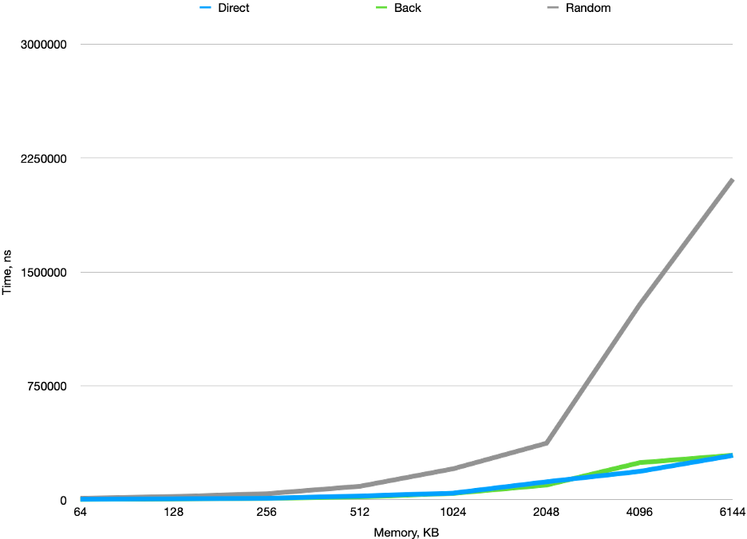

investigation:
  travel_variant: "direct"
  experiments:
  - experiment:
      number: 1
      input_data:
        buffer_size: "64kb"
      results:
        duration: "3215.91 ns"
  - experiment:
      number: 2
      input_data:
        buffer_size: "128kb"
      results:
        duration: "6618.62 ns"
  - experiment:
        number: 3
        input_data:
          buffer_size: "256kb"
        results:
          duration: "10376.1 ns"
  - experiment:
        number: 4
        input_data:
          buffer_size: "512kb"
        results:
          duration: "25185.5 ns"
  - experiment:
        number: 5
        input_data:
          buffer_size: "1024kb"
        results:
          duration: "44028.3 ns"
  - experiment:
          number: 6
          input_data:
            buffer_size: "2048kb"
          results:
            duration: "118664 ns"
  - experiment:
          number: 7
          input_data:
            buffer_size: "4096kb"
          results:
            duration: "187137 ns"
  - experiment:
          number: 8
          input_data:
            buffer_size: "6144kb"
          results:
            duration: "292266 ns"
            
investigation:
  travel_variant: "back"
  experiments:
  - experiment:
      number: 1
      input_data:
        buffer_size: "64kb"
      results:
        duration: "2400.89 ns"
  - experiment:
      number: 2
      input_data:
        buffer_size: "128kb"
      results:
        duration: "4815.16 ns"
  - experiment:
        number: 3
        input_data:
          buffer_size: "256kb"
        results:
          duration: "9608.16 ns"
  - experiment:
        number: 4
        input_data:
          buffer_size: "512kb"
        results:
          duration: "19150.4 ns"
  - experiment:
        number: 5
        input_data:
          buffer_size: "1024kb"
        results:
          duration: "42329.2 ns"
  - experiment:
          number: 6
          input_data:
            buffer_size: "2048kb"
          results:
            duration: "97283.9 ns"
  - experiment:
          number: 7
          input_data:
            buffer_size: "4096kb"
          results:
            duration: "244491 ns"
  - experiment:
          number: 8
          input_data:
            buffer_size: "6144kb"
          results:
            duration: "293335 ns"
            
investigation:
  travel_variant: "random"
  experiments:
  - experiment:
      number: 1
      input_data:
        buffer_size: "64kb"
      results:
        duration: "10044.4 ns"
  - experiment:
      number: 2
      input_data:
        buffer_size: "128kb"
      results:
        duration: "21710.6 ns"
  - experiment:
        number: 3
        input_data:
          buffer_size: "256kb"
        results:
          duration: "40239.5 ns"
  - experiment:
        number: 4
        input_data:
          buffer_size: "512kb"
        results:
          duration: "89105.8 ns"
  - experiment:
        number: 5
        input_data:
          buffer_size: "1024kb"
        results:
          duration: "204564 ns"
  - experiment:
          number: 6
          input_data:
            buffer_size: "2048kb"
          results:
            duration: "372381 ns"
  - experiment:
          number: 7
          input_data:
            buffer_size: "4096kb"
          results:
            duration: "1285480 ns"
  - experiment:
          number: 8
          input_data:
            buffer_size: "6144kb"
          results:
            duration: "2111820 ns"

